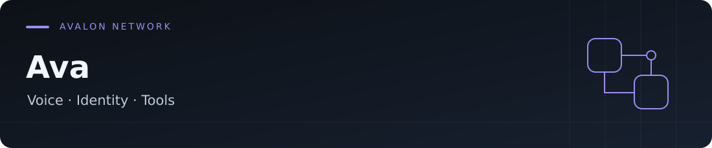
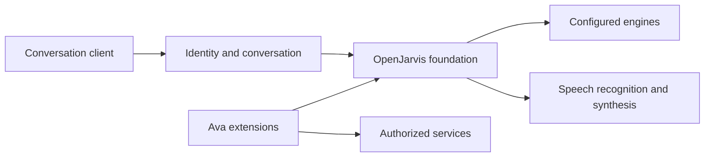

<div align="center">



# Ava

**A French-speaking personal assistant with voice, tools and scoped access.**

Ava adapts OpenJarvis to a self-hosted environment: conversation, speech synthesis,
targeted integrations, and work on identity and conversational memory.

[Ava code](https://github.com/AdrienAvalon/ava/tree/ava-main) · [Extensions](https://github.com/AdrienAvalon/ava/tree/ava-main/ava_extensions) · [Français](README.md) · [English](README.en.md)

[](https://github.com/AdrienAvalon/ava/tree/ava-main/ava_extensions)
[](https://github.com/AdrienAvalon/ava/tree/ava-main/rust)
[](https://github.com/open-jarvis/OpenJarvis)
[](LICENSE)

</div>

## Start with the right branch

**Ava-specific development lives on [`ava-main`](https://github.com/AdrienAvalon/ava/tree/ava-main).**
The `main` branch is reserved for tracking OpenJarvis. GitHub presents `ava-main`,
the project branch; links to the extensions below explicitly target it.

## At a glance

| Area | What the Ava extensions provide |
|---|---|
| **French conversation** | A shared persona, temporal context and conversation engine integration |
| **Voice** | Adapters for Whisper-compatible recognition and French Kokoro synthesis |
| **Identity** | Principal validation and conversation isolation by verified identity |
| **Targeted tools** | Adapters to read infrastructure status, inspect logs and propose changes |
| **Execution** | Runtime bootstrapping from a sealed release with environment verification |
| **Evaluation** | Contract tests, adversarial scenarios and shadow evaluations before promotion |

These capabilities describe the project code. Accessible external services, selected
engines and enabled features depend on each installation's configuration.
Self-hosted does not mean all inference is local: some adapters call model or speech
recognition APIs.

## Why Ava

The project combines a French conversational experience with useful integrations for a
personal environment. Adaptations live mainly in
[`ava_extensions/`](https://github.com/AdrienAvalon/ava/tree/ava-main/ava_extensions),
so their differences from OpenJarvis remain visible and upstream synchronization is easier.

A model's response remains a proposal. The application establishes tool access, the
speaker's identity and retention rules.

## Explore the project

To obtain the development branch:

```bash
git clone --branch ava-main https://github.com/AdrienAvalon/ava.git
cd ava
```

Then choose an entry point:

1. [Extension layout](https://github.com/AdrienAvalon/ava/blob/ava-main/ava_extensions/README.md).
2. [OpenJarvis adaptations and their rationale](https://github.com/AdrienAvalon/ava/blob/ava-main/ava_extensions/patches/README.md).
3. [Ava-specific tests](https://github.com/AdrienAvalon/ava/tree/ava-main/ava_extensions/tests).
4. [Contributing to the OpenJarvis foundation](https://github.com/AdrienAvalon/ava/blob/ava-main/CONTRIBUTING.md).

Cloning provides the sources. A working installation also needs engine configuration,
voice dependencies and selected services; generic OpenJarvis installers alone do not
set up the Ava environment.

## Architecture



| To understand… | Read… |
|---|---|
| The identity boundary | [`ava_extensions/server/`](https://github.com/AdrienAvalon/ava/tree/ava-main/ava_extensions/server) |
| Voice adapters | [`ava_extensions/backends/`](https://github.com/AdrienAvalon/ava/tree/ava-main/ava_extensions/backends) |
| Ava tools | [`ava_extensions/skills/`](https://github.com/AdrienAvalon/ava/tree/ava-main/ava_extensions/skills) |
| Controlled startup | [`runtime_bootstrap.py`](https://github.com/AdrienAvalon/ava/blob/ava-main/ava_extensions/runtime_bootstrap.py) |
| Evaluations | [`ava_extensions/evals/`](https://github.com/AdrienAvalon/ava/tree/ava-main/ava_extensions/evals) |

## Status and limitations

Ava remains a project under development, with environment-specific integrations.
Not every general OpenJarvis capability is enabled in Ava.

- **Governed memory: experimental.** The ledger and its checks remain in shadow;
  their presence in the code does not establish a validated canonical memory.
- **Automatic learning: disabled.** A
  [dedicated guard](https://github.com/AdrienAvalon/ava/blob/ava-main/ava_extensions/patches/learning_guard.py)
  keeps upstream optimizers out of the authorized execution path.
- **Evaluations: evidence to interpret.** A passing scenario or model consensus alone
  cannot authorize a new capability or promote a memory.
- **Integrations: configuration required.** Infrastructure adapters are not a generic
  installation ready to connect to any system.

## Quality and contribution

The [extension tests](https://github.com/AdrienAvalon/ava/tree/ava-main/ava_extensions/tests)
cover identity, conversations, tool boundaries, voice and experimental memory.
[Evaluation corpora](https://github.com/AdrienAvalon/ava/tree/ava-main/ava_extensions/evals)
complement those tests. Their presence documents the method; results depend on the
revision and scope actually executed.

For an Ava-specific contribution, start from `ava-main`, keep the change scoped and
add appropriate evidence. Changes to the foundation should remain identifiable and
retain upstream attribution.

## OpenJarvis and licence

Ava is a fork of **[OpenJarvis](https://github.com/open-jarvis/OpenJarvis)**,
a project originating from Hazy Research and the Scaling Intelligence Lab at Stanford.
Its [upstream documentation](https://open-jarvis.github.io/OpenJarvis/) describes the
framework and its general capabilities, rather than Ava's activation policy.

The root license is [Apache 2.0](LICENSE), with attribution to the OpenJarvis authors.
The [Tauri application manifest](frontend/src-tauri/Cargo.toml) separately declares MIT,
as in the upstream project; this scope difference needs clarification before redistribution.
Component licenses and model-specific terms remain applicable.
