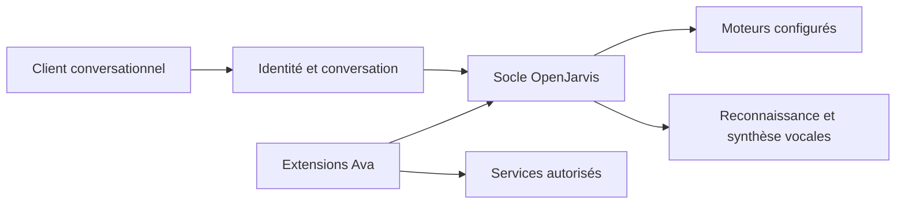

<div align="center">


# Ava

**Un assistant personnel en français, avec la voix, des outils et des accès délimités.**

Ava adapte OpenJarvis à un environnement auto-hébergé : conversation, synthèse vocale,
intégrations ciblées et travail sur l'identité et la mémoire des échanges.

[Code Ava](https://github.com/AdrienAvalon/ava/tree/ava-main) · [Extensions](https://github.com/AdrienAvalon/ava/tree/ava-main/ava_extensions) · [Français](README.md) · [English](README.en.md)

[](https://github.com/AdrienAvalon/ava/tree/ava-main/ava_extensions)
[](https://github.com/AdrienAvalon/ava/tree/ava-main/rust)
[](https://github.com/open-jarvis/OpenJarvis)
[](LICENSE)

</div>

## Commencer par la bonne branche

**Le développement propre à Ava se trouve sur [`ava-main`](https://github.com/AdrienAvalon/ava/tree/ava-main).**
La branche `main` est réservée au suivi d’OpenJarvis. GitHub présente `ava-main`,
la branche propre au projet ; les liens vers les extensions ci-dessous la visent explicitement.

## En bref

| Domaine | Ce que portent les extensions Ava |
|---|---|
| **Conversation en français** | Persona commune, contexte temporel et intégration du moteur conversationnel |
| **Voix** | Adaptateurs de reconnaissance compatible Whisper et de synthèse française Kokoro |
| **Identité** | Validation du principal et cloisonnement des conversations par identité vérifiée |
| **Outils ciblés** | Adaptateurs pour lire l'état de l'infrastructure, consulter des journaux et proposer des évolutions |
| **Exécution** | Amorçage du runtime depuis une release scellée, avec vérification de son environnement |
| **Évaluation** | Tests de contrats, scénarios adversariaux et évaluations en shadow avant promotion |

Ces capacités décrivent le code du projet. Les services externes accessibles, les moteurs
utilisés et les fonctionnalités activées dépendent de la configuration de l'installation.
Auto-hébergé ne signifie pas que toutes les inférences sont locales : des adaptateurs
appellent des API de modèles ou de reconnaissance vocale.

## Pourquoi Ava

Le projet réunit une expérience conversationnelle en français et des intégrations utiles
dans un environnement personnel. Les adaptations vivent principalement dans
[`ava_extensions/`](https://github.com/AdrienAvalon/ava/tree/ava-main/ava_extensions),
pour garder lisible leur différence avec OpenJarvis et faciliter les synchronisations amont.

Une réponse de modèle reste une proposition. Les accès aux outils, l'identité de
l'interlocuteur et les règles de conservation sont établis par l'application.

## Parcourir le projet

Pour obtenir la branche de développement :

```bash
git clone --branch ava-main https://github.com/AdrienAvalon/ava.git
cd ava
```

Puis choisir son point d'entrée :

1. [L'organisation des extensions](https://github.com/AdrienAvalon/ava/blob/ava-main/ava_extensions/README.md).
2. [Les adaptations d'OpenJarvis et leur justification](https://github.com/AdrienAvalon/ava/blob/ava-main/ava_extensions/patches/README.md).
3. [Les tests propres à Ava](https://github.com/AdrienAvalon/ava/tree/ava-main/ava_extensions/tests).
4. [La contribution au socle OpenJarvis](https://github.com/AdrienAvalon/ava/blob/ava-main/CONTRIBUTING.md).

Le clonage donne accès aux sources. Une installation fonctionnelle demande également
la configuration des moteurs, les dépendances vocales et les services choisis ; les
installateurs génériques d'OpenJarvis n'installent pas à eux seuls l'environnement Ava.

## Architecture



| Pour comprendre… | Lire… |
|---|---|
| La frontière d'identité | [`ava_extensions/server/`](https://github.com/AdrienAvalon/ava/tree/ava-main/ava_extensions/server) |
| Les adaptateurs vocaux | [`ava_extensions/backends/`](https://github.com/AdrienAvalon/ava/tree/ava-main/ava_extensions/backends) |
| Les outils Ava | [`ava_extensions/skills/`](https://github.com/AdrienAvalon/ava/tree/ava-main/ava_extensions/skills) |
| Le démarrage contrôlé | [`runtime_bootstrap.py`](https://github.com/AdrienAvalon/ava/blob/ava-main/ava_extensions/runtime_bootstrap.py) |
| Les évaluations | [`ava_extensions/evals/`](https://github.com/AdrienAvalon/ava/tree/ava-main/ava_extensions/evals) |

## État et limites

Ava reste un projet en développement, avec des intégrations propres à son environnement.
Les capacités générales d'OpenJarvis ne sont pas toutes activées dans Ava.

- **Mémoire gouvernée : expérimentale.** Le ledger et ses vérifications restent en
  shadow ; leur présence dans le code ne vaut pas validation d'une mémoire canonique.
- **Apprentissage automatique : désactivé.** Le
  [garde dédié](https://github.com/AdrienAvalon/ava/blob/ava-main/ava_extensions/patches/learning_guard.py)
  maintient les optimiseurs amont hors du parcours d'exécution autorisé.
- **Évaluations : des preuves à interpréter.** Un scénario réussi ou un consensus de
  modèles ne suffit pas à autoriser une nouvelle capacité ni à promouvoir un souvenir.
- **Intégrations : configuration nécessaire.** Les adaptateurs d'infrastructure ne
  constituent pas une installation générique prête à connecter à n'importe quel système.

## Qualité et contribution

Les [tests des extensions](https://github.com/AdrienAvalon/ava/tree/ava-main/ava_extensions/tests)
couvrent notamment l'identité, les conversations, les limites des outils, la voix et la
mémoire expérimentale. Les [corpus d'évaluation](https://github.com/AdrienAvalon/ava/tree/ava-main/ava_extensions/evals)
complètent ces tests. Leur présence documente la méthode ; les résultats dépendent de la
révision et du périmètre exécutés.

Pour une contribution propre à Ava, partir de `ava-main`, limiter le changement à son
périmètre et ajouter une preuve adaptée. Les modifications du socle doivent rester
identifiables et conserver l'attribution amont.

## OpenJarvis et licence

Ava est un fork de **[OpenJarvis](https://github.com/open-jarvis/OpenJarvis)**,
un projet issu de Hazy Research et du Scaling Intelligence Lab à Stanford.
Sa [documentation amont](https://open-jarvis.github.io/OpenJarvis/) décrit le framework
et ses possibilités générales ; elle ne décrit pas la politique d'activation propre à Ava.

La licence racine est [Apache 2.0](LICENSE), avec l'attribution aux auteurs d'OpenJarvis.
Le [manifeste de l'application Tauri](frontend/src-tauri/Cargo.toml) annonce séparément MIT,
comme dans le projet amont ; cette différence de portée reste à clarifier avant sa redistribution.
Les licences des composants et les conditions propres aux modèles restent applicables.
